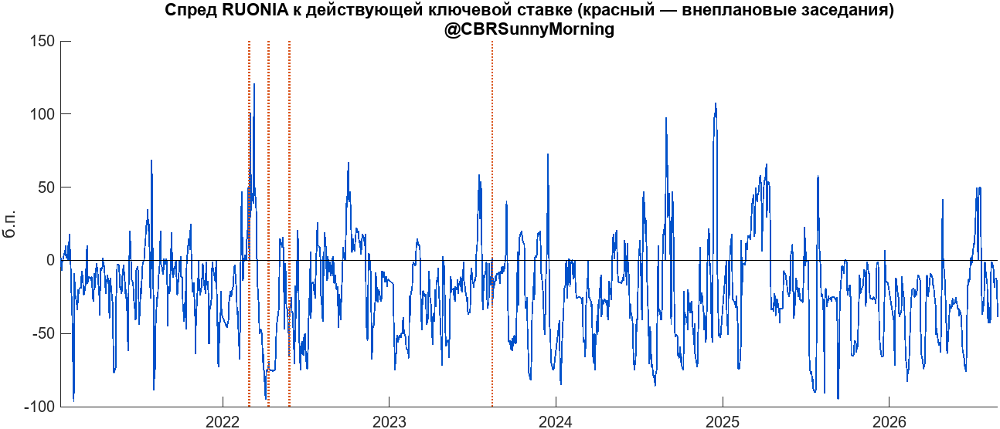
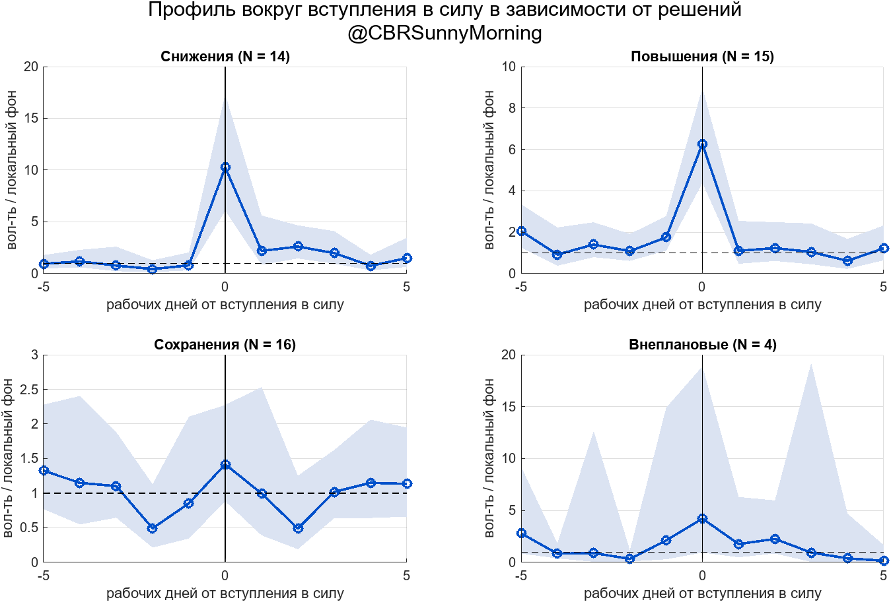
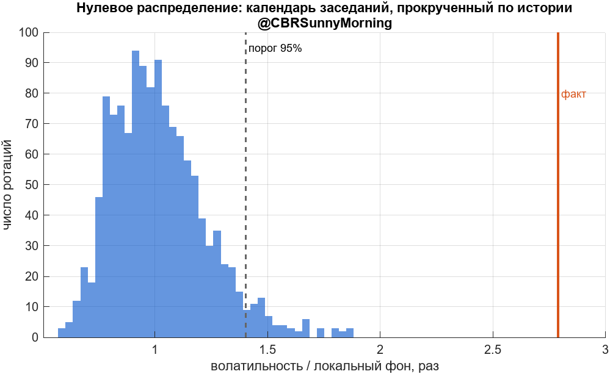
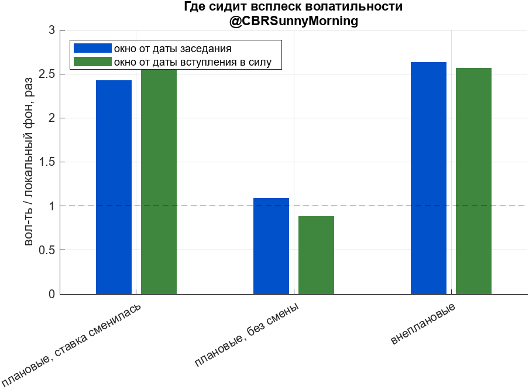
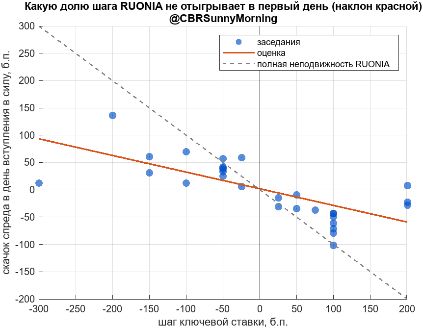
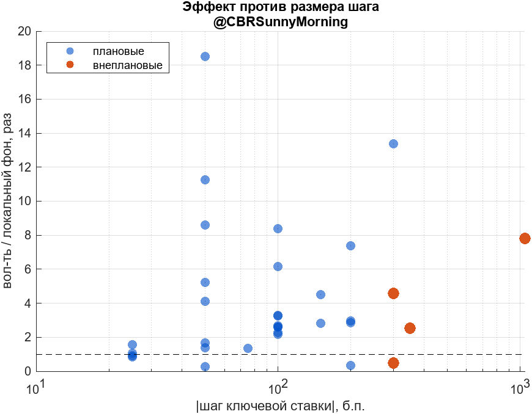
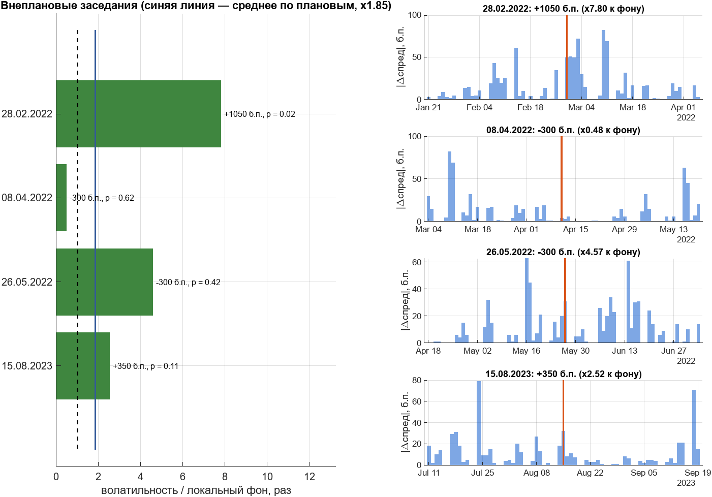
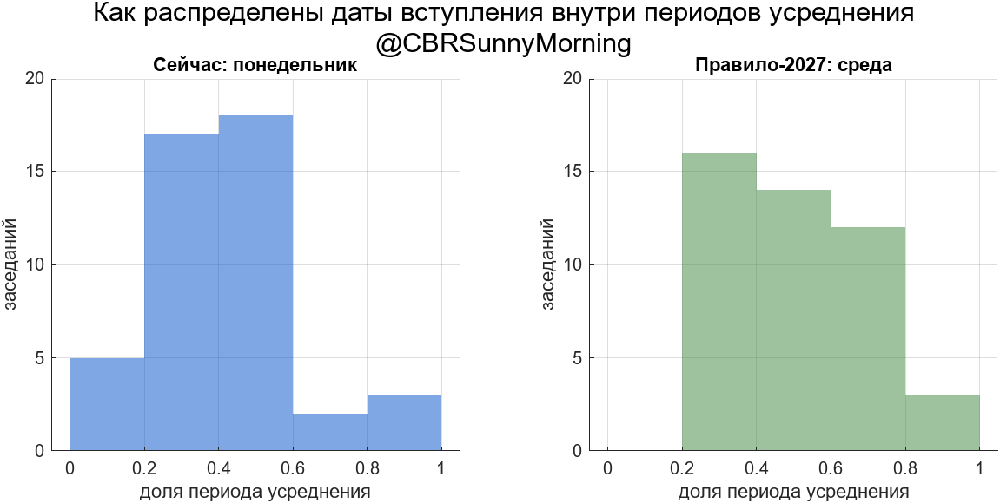

# Волатильность RUONIA вокруг решений по ключевой ставке

Эмпирическая проверка реформы, заявленной в проекте [ОНЕГДКП на 2027–2029](https://www.cbr.ru/about_br/publ/ondkp/on_2027_2029/): с 2027 года ключевая ставка будет вступать в силу не с ближайшего понедельника, а с ближайшей среды — чтобы совпадать с началом периода усреднения обязательных резервов (ПУ).

Заявленная цель Банка России — снизить волатильность ставок денежного рынка. Репозиторий отвечает на два вопроса: **где эта волатильность сейчас сидит** и **сколько реформа может дать в единицах, которыми оперирует сам регулятор**.

Разбор для читателя: [@CBRSunnyMorning](https://t.me/CBRSunnyMorning/28110) · [#sunny_models](https://t.me/CBRSunnyMorning)

---

## Коротко

| Что меряем | Результат |
|---|---|
| ПУ **без** смены ставки, СКО спреда внутри периода | **18.7 б.п.** (N = 37) |
| ПУ **со** сменой ставки, СКО спреда внутри периода | **28.4 б.п.** (N = 31) |
| Разница | **+9.6 б.п.**, порог 95% = 6.4, `p = 0.0007` |
| Прогноз эффекта реформы (сдвиг смены ставки к началу ПУ) | **−11.3 б.п.** — почти до уровня периодов без смены |
| Дневная вол-ть: снижения ставки | **×3.89** к собственному фону (`p ≈ 0`) |
| Дневная вол-ть: повышения ставки | **×2.04** (`p = 0.003`) |
| Дневная вол-ть: сохранения ставки | **×0.88** — порог 1.66 не пройден |
| Величина сюрприза (консенсус минус факт) | коэф. −0.025, `t = −0.09` — **не объясняет ничего** |
| Размер шага ставки | значим в логах (`t = 3.33`), но всплеск даёт и шаг 25 б.п. |
| Проведение ставки в первый день | рынок **не отыгрывает 31%** шага |

**Вывод.** Всплеск порождает не новость и не её неожиданность, а сам факт смены уровня внутри периода усреднения. Проблема операционная, а не коммуникационная — и лечится календарём, что и делает ЦБ.

---

## 1. Механизм, который проверяем

Коммерческий банк выполняет норматив обязательных резервов (в части остатков на корсчёте) не каждый день, а **в среднем за период усреднения** — 28 или 35 дней, начало всегда в среду.

* **Внутри периода дни взаимозаменяемы**: сегодня можно держать меньше, но тогда завтра больше.
* **Между периодами — нет**: недобор одного ПУ перебором следующего не закрывается.
* Резервы процентов не приносят, поэтому цена держания рубля на корсчёте равна тому, что за него дают на рынке.

Когда ставка меняется **посреди** периода, дни до и после перестают быть равноценными: перед снижением деньги сегодня дороже. Банку выгодно недодержать сейчас и передержать потом, отдав излишек на межбанк. Объём резервов не меняется ни на рубль — меняется его распределение внутри периода. Этого достаточно, чтобы сдвинуть овернайт.

Если механизм именно такой, всплеск обязан **слабеть по мере сдвига смены ставки к началу ПУ** — перебрасывать становится некуда. Это и есть тестируемое предсказание (раздел 6.2).

---

## 2. Данные

| Файл | Содержание | Источник |
|---|---|---|
| `ruonia.xlsx` | `Date`, `Value` — дневная RUONIA, 1367 наблюдений, 11.01.2021 — 27.08.2026 | [cbr.ru](https://www.cbr.ru/hd_base/ruonia/) |
| `decisions.xlsx` | `Date`, `Extra`, `RateNew`, `Consensus`, `EffDate` — 49 заседаний (45 плановых, 4 внеплановых), 17 с ненулевым сюрпризом | пресс-релизы ЦБ, консенсус — опросы рынка |
| `reserves.xlsx` | Колонки 1–6: `Start`, `End`, `Days`, `RepPeriod`, `StartReg`, `EndReg` — 72 периода усреднения, 13.01.2021 — 12.01.2027 | [cbr.ru/oper_br/oap](https://www.cbr.ru/oper_br/oap/) |

Замечания по данным:

* **Торговый календарь задаёт сам файл RUONIA.** Какие даты в нём есть, те и рабочие. Выходные не выбрасываем: в выборке есть перенесённые рабочие субботы, RUONIA в них считается.
* **`EffDate` задана явно**, в том числе вручную для внеплановых. У плановых решений ставка начинает действовать в ближайший понедельник, у внеплановых — в тот же или на следующий день.
* Все 72 периода усреднения начинаются в среду — это проверяется на входе (`assert` в разделе 1 скрипта).

---

## 3. Запуск

```matlab
% MATLAB R2018b+, только базовый функционал (toolbox'ы не нужны)
% ruonia.xlsx, decisions.xlsx, reserves.xlsx — в рабочей папке
run('RUONIA_VOL_REAL_SHORT_GH.mlx')
```

Скрипт самодостаточен: все вспомогательные функции (`stepSeries`, `baselineOffsets`, `avEvents`, `rotationTest`, `ols` с робастными ошибками Уайта, `prctile_`) лежат в конце файла. `rng(20260901)` фиксирует зерно, перестановочный тест воспроизводится побитово.

Ключевые настройки собраны в структуре `cfg`:

```matlab
cfg.far      = -30;    % стартовая глубина окна фона
cfg.otherWin = -1:3;   % дни влияния чужого заседания (вырезаются из фона)
cfg.minBase  = 10;     % минимум дней в фоне
cfg.hit      = [0 1 2];% ядро окна события
cfg.tau      = -5:5;   % окно для профиля
cfg.minShift = 10;     % минимальная ротация календаря, торговых дней
cfg.nPerm    = 20000;  % перестановок ярлыков
```

---

## 4. Методика

### 4.1 Спред, а не сама RUONIA

Ставка меняется в дату вступления в силу, и по сырой RUONIA в этот день будет механический скачок на величину шага — до 1050 б.п. в феврале 2022 г. Это не волатильность рынка. Поэтому работаем со спредом `(RUONIA − действующая ключевая) × 100` в б.п.



### 4.2 Сверка с опубликованными числами ЦБ

ЦБ измеряет волатильность как СКО спреда RUONIA к ключевой ставке в б.п. Прогоняем свой расчёт по тем же периодам — если числа сходятся, значит пайплайн считает ровно то же, что регулятор.

| Период | Наше (сред. / СКО) | ЦБ (сред. / СКО) |
|---|---|---|
| 2023 год | −23 / 28 | −23 / 28 |
| янв–сен 2024 | −23 / 33 | −23 / 33 |
| 2025 год | −17 / 35 | — / 37 |
| янв–июл 2026 | −28 / 28 | −28 / 28 |

### 4.3 Мера дневной волатильности

Прокси — `|Δспреда|` день ко дню: не зависит от уровня спреда и не заражена скачком ставки. Медиана 6.0 б.п., среднее 11.2 б.п. Логарифмируем (распределение скошено вправо), пол 0.1 б.п. защищает от `log(0)`.

### 4.4 Локальный фон

Мера события: `AV = log(vol)` в ядре `[0..+2]` **минус** средняя `log(vol)` в окне перед **этим же** заседанием. Читается как «во сколько раз выше собственного фона», 1.00 = ничего не произошло.

**Почему локальный, а не общий фон.** В 2022 г. фоновая волатильность сама была в разы выше, чем в 2024 г. Сравнение с общим средним по выборке дало бы «рост» у любого события турбулентного года автоматически.

**Дальний край `−30`.** Фон не должен захватывать всплеск предыдущего заседания. Медианный интервал между заседаниями 29 торговых дней, но минимальный — 9 (внеплановое 26.05.2022 и плановое 10.06.2022). Фиксированной глубиной это не решается: при −30 фон задевает чужое окно у 37 заседаний из 49, при −18 всё ещё у 7. Поэтому дни влияния **любого** другого заседания вырезаются, а если осталось меньше `minBase` — окно углубляется. Факт: минимум 18 дней в фоне, медиана 23.

**Ближний край** = `−(лаг заседание→вступление) − 2`, сейчас `−3`. С 2027 г. лаг станет 3 дня и край сам уедет на −5.

### 4.5 Значимость: ротация календаря, а не t-тест

Нужен нулевой мир, а не формула. Берём **реальный календарь заседаний целиком** и прокручиваем по истории: интервалы между заседаниями, их число и растянутость сохраняются, разрушается только привязка к фактическим решениям. Геометрия фона едет вместе с календарём.

* **Почему ротация, а не линейный сдвиг.** Календарь занимает почти всю выборку; линейных сдвигов остаётся около десятка, минимально достижимое `p ≈ 0.08`.
* **Почему не набор случайных дат.** Такой нулевой мир допускает конфигурации, которые реальный график породить не мог, и занижает порог.
* **Цена ротации** — один шов на стыке: из 44 интервалов портится один.

Второй тест — **перестановка ярлыков**: даты заседаний неподвижны, тасуются типы решений. Ротация спрашивает «особенные ли эти даты вообще», перестановка — «особенны ли снижения *среди* заседаний».

---

## 5. Результаты в дневных данных

### 5.1 Профиль вокруг вступления в силу

Почти весь эффект сидит в **одном дне** — в дате вступления ставки в силу. При сохранении ставки всплеска нет вообще.



### 5.2 Ротация календаря

| Группа | N | Факт, ×фон | Порог 95% | p (ротация) | p (перестановка) |
|---|---:|---:|---:|---:|---:|
| Снижения | 14 | **3.89** | 1.60 | 0.0000 | 0.0016 |
| Повышения | 15 | **2.04** | 1.59 | 0.0030 | 0.3629 |
| Сохранения | 16 | 0.88 | 1.66 | 0.638 | 0.998 |
| Все со сменой | 29 | **2.79** | 1.40 | 0.0000 | 0.0013 |
| Все плановые | 45 | 1.85 | 1.31 | 0.0000 | — |
| Внеплановые | 4 | 2.57 | 2.44 | 0.036 | — |

Порог 95% — **критическое** значение, а не нулевое: нулевое = 1.00. Ротаций 1316, минимально достижимое `p = 0.0008` — записать «p < 0.001» нельзя.

Расхождение двух тестов информативно: повышения проходят ротацию, но не проходят перестановку — их эффект есть общий эффект смены ставки, а не что-то специфичное для повышений.



### 5.3 Объявление или вступление в силу

У внеплановых эти даты совпадают, у плановых разнесены на 3 календарных дня, с 2027 г. станут на 5. Прямая проверка логики ЦБ: всплеск привязан к дате **вступления**, а не к дате заседания.



`|Δспреда|` в день заседания (ставка ещё старая) — 10.3 б.п. против обычного дня 11.2 б.п. То есть в день объявления не происходит **ничего**.

### 5.4 Из чего состоит всплеск: неполное проведение ставки

Если бы RUONIA мгновенно перескакивала на новый уровень, спред бы не дрогнул; если бы не двигалась вовсе — прыгнул бы ровно на `−Δставки`. Оценка:

```
Δспреда(0) = −0.31 × Δставки + 1.9     (корр. −0.70)
```

Рынок не отыгрывает **31%** шага в первый день. `|Δспреда|` в день 0 — 43.3 б.п. при среднем `|шаге|` 99 б.п.

Это эффект стратегий усреднения резервов, и описывать его корректнее как *неполное проведение ставки*, а не как «рост волатильности».



### 5.5 Сюрприз ничего не объясняет

Простое сравнение «сюрприз есть / нет» вводит в заблуждение: сюрпризы случаются чаще там, где ставка меняется. Двумерная таблица:

| Ставка | Сюрприз | N | ×фон |
|---|---|---:|---:|
| изменилась | есть | 16 | 2.41 |
| изменилась | нет | 13 | **3.33** |
| не менялась | есть | 1 | 0.58 |
| не менялась | нет | 15 | 0.91 |

Регрессия (робастные ошибки Уайта, N = 45, R² = 0.198):

| Регрессор | коэф. | ст.ош. | t | p |
|---|---:|---:|---:|---:|
| const | −0.120 | 0.349 | −0.34 | 0.732 |
| ставка изменилась | **1.154** | 0.390 | **2.96** | 0.005 |
| \|сюрприз\|, п.п. | −0.025 | 0.263 | −0.09 | 0.926 |

Контрфактика: факт ×1.85, все сюрпризы обнулены ×1.86, без смены ставки ×0.89. **Полностью предсказанное снижение даёт то же, что неожиданное.**

### 5.6 Единая шкала: эффект против размера шага

Корректный способ поставить внеплановые в общий ряд — не сравнивать группы, а проверить, ложатся ли все 49 заседаний на одну зависимость «эффект от шага».

| Регрессор | коэф. | ст.ош. | t | p |
|---|---:|---:|---:|---:|
| const | −0.163 | 0.327 | −0.50 | 0.620 |
| log\|шаг ставки\| | 0.277 | 0.083 | **3.33** | 0.002 |
| I(внеплановое) | −0.570 | 0.566 | −1.01 | 0.320 |

`I(внеплановое)` не отличим от нуля: внеплановые ведут себя как плановые с таким же шагом, отдельная категория не нужна. N = 49, R² = 0.226.



### 5.7 Внеплановые — только поштучно

N = 4, СКО нулевого распределения 0.57 в логах против 0.16 у сорока пяти плановых — ровно `sqrt(45/4)`. Отсюда порог около 2.4× вместо 1.3×, и настройкой окна это не лечится.

| Дата | Шаг, б.п. | Фон, б.п. | Событие, б.п. | ×фон | локальный p |
|---|---:|---:|---:|---:|---:|
| 28.02.2022 | +1050 | 6.5 | 50.3 | 7.80 | 0.017 |
| 08.04.2022 | −300 | 8.6 | 4.2 | 0.48 | 0.620 |
| 26.05.2022 | −300 | 2.0 | 9.2 | 4.57 | 0.421 |
| 15.08.2023 | +350 | 5.6 | 14.1 | 2.52 | 0.107 |

У 08.04.2022 испорчен сам фон: его окно приходится на март 2022 г., самый турбулентный отрезок выборки. Шаги внеплановых сопоставимы лишь с одним плановым решением, так что «внеплановость» и «огромный шаг» в этой выборке разделить невозможно в принципе.



---

## 6. Главный результат — в метрике Банка России

Операционная цель регулятора сформулирована **по периодам усреднения**: средний за ПУ спред RUONIA к ключевой по модулю не выше 25 б.п. Дневная аномальная волатильность из раздела 5 отвечает на другой вопрос и с показателями ЦБ напрямую не сопоставляется — поэтому она второй слой, а не первый.

### 6.1 Периоды со сменой ставки против периодов без

Периодов с данными: 68. Доля ПУ, пробивающих порог `|ср. спред| > 25 б.п.`: **44%**.

| | N | \|ср. спред\| | СКО внутри ПУ | > 25 б.п. |
|---|---:|---:|---:|---:|
| ПУ **без** смены ставки | 37 | 22.1 | **18.7** | 41% |
| ПУ **со** сменой ставки | 31 | 25.8 | **28.4** | 48% |

Разница СКО: **+9.6 б.п.**, порог 95% = 6.4, `p = 0.0007` (1348 ротаций). Тест — та же ротация календаря заседаний, а не t-тест: нулевой мир согласован с дневным.

### 6.2 Прямой тест реформы: где внутри ПУ меняется ставка

Если механизм — переброска резервов между дорогими и дешёвыми днями, всплеск обязан слабеть, когда смена ставки уезжает к началу периода.

| Место смены ставки внутри ПУ | N | СКО спреда |
|---|---:|---:|
| первая четверть | 10 | 25.2 б.п. |
| вторая | 11 | 24.8 б.п. |
| третья | 9 | 33.3 б.п. |
| последняя | 1 | 54.5 б.п. |
| *(ПУ без смены — ориентир)* | *37* | *18.7 б.п.* |

Регрессия (N = 31, R² = 0.191):

| Регрессор | коэф. | ст.ош. | t | p |
|---|---:|---:|---:|---:|
| const | 12.235 | 10.027 | 1.22 | 0.233 |
| позиция в ПУ | **22.679** | 13.774 | 1.65 | 0.111 |
| log\|шаг ставки\| | 1.468 | 2.731 | 0.54 | 0.595 |

**Прогноз эффекта реформы:** сдвиг смены ставки с середины периода (0.5) на его начало (0) снизил бы СКО внутри ПУ на **11.3 б.п.** — то есть почти до уровня периодов без смены.

> ⚠️ Последняя четверть — **одно** наблюдение, и наклон держится на нём. Коэффициент при позиции значим на 11%, а не на 5%. Это оценка направления и порядка величины, а не точечный прогноз.

### 6.3 Куда попадают даты вступления сейчас и куда попадут по правилу-2027

Средняя позиция вступления внутри ПУ: сейчас (понедельник) **0.43**, по правилу-2027 (среда) **0.46**. Ровно на первый день ПУ не попадает **ни одно** из 45 плановых заседаний — ни сейчас, ни по новому правилу на текущем календаре усреднения.



Это ключевая оговорка: **правило «среда» само по себе синхронизацию не даёт**. Синхронизация требует, чтобы под новое правило был подстроен и график периодов усреднения. В проекте ОНЕГДКП сказано, что периоды будут изменены, но календарь на 2027 год на момент расчётов не опубликован.

### 6.4 Собственный календарный эффект ПУ

Конкурирующее объяснение, которое нужно держать в голове: у самого периода усреднения есть свой ритм.

`|Δспреда|`: последние 2 дня ПУ — **19.2 б.п.**, первые 2 дня — **15.5 б.п.**, прочие дни — **9.7 б.п.**

---

## 7. Ограничения

1. **Позиция смены ставки внутри ПУ значима на 11%, не на 5%.** Наклон держится на одном наблюдении в последней четверти. Оценка −11 б.п. — порядок величины.
2. **Внеплановые: N = 4.** Формально проходят ротацию, но 08.04.2022 с испорченным фоном и 28.02.2022 с шагом +1050 б.п. делают любые групповые выводы по ним хрупкими.
3. **«Внеплановость» и «огромный шаг» неразделимы** в этой выборке.
4. **Один шов в ротации:** из 44 интервалов между заседаниями один портится на стыке начала и конца.
5. **Выборка начинается с 2021 года** и включает 2022-й — отрезок с фоновой волатильностью в разы выше обычной. Локальный фон это лечит, но не устраняет полностью.
6. **Новый календарь ПУ на 2027 год не опубликован**, поэтому прогноз строится на текущем графике усреднения.

---

## 8. Что дальше

* Пересчитать после публикации календаря периодов усреднения на 2027 год.
* Накопить наблюдения после вступления реформы в силу и проверить оценку −11 б.п. постфактум.
* Добавить второй слой ликвидности (структурный профицит/дефицит, объёмы депозитных аукционов) как контроль.

---

## 9. Структура репозитория

```
.
├── RUONIA_VOL_REAL_SHORT_GH.mlx   # основной скрипт, публичная версия
├── ruonia.xlsx                     # RUONIA, дневная
├── decisions.xlsx                  # заседания: дата, ставка, консенсус, EffDate
├── reserves.xlsx                   # график периодов усреднения (cbr.ru/oper_br/oap)
└── Charts/
    ├── RUONIA_KEY_SPRD.png         # спред к действующей ключевой
    ├── PROFILE_TYPES.png           # профиль ±5 дней по типам решений
    ├── RES_CAL.png                 # даты вступления внутри ПУ: сейчас vs 2027
    ├── EFF_IN_PERIOD.png           # СКО внутри ПУ vs позиция смены ставки
    ├── ROTATIONS_VOL_LOC.png       # нулевое распределение ротаций
    ├── VOL3.png                    # объявление vs вступление в силу
    ├── STEP_DONE.png               # неполное проведение ставки
    ├── STEP_VOL.png                # эффект против размера шага
    └── EXTRA.png                   # внеплановые заседания поштучно
```

---

## Источники

* Банк России — [RUONIA](https://www.cbr.ru/hd_base/ruonia/)
* Банк России — [обязательные резервы, периоды усреднения](https://www.cbr.ru/oper_br/oap/)
* Банк России — [проект ОНЕГДКП на 2027–2029](https://www.cbr.ru/about_br/publ/ondkp/on_2027_2029/)
* Пресс-релизы по ключевой ставке — ссылки на каждое заседание есть в расширенной версии `decisions`

## Обратная связь

Нашли ошибку или хотите дополнить — issues и pull requests приветствуются. Разбор и обсуждение: [@CBRSunnyMorning](https://t.me/CBRSunnyMorning).
